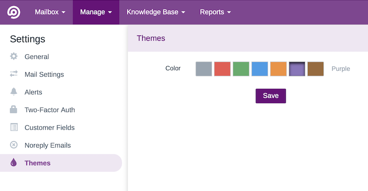

# FreeScout Themes Module
 Change the colour scheme of [FreeScout](https://github.com/freescout-helpdesk/freescout "FreeScout")
 
 
 
## To Do
* Add ability to configure a custom theme
* Add compatibility with the FreeScout Dark Mode Module
* Not all UI elements have been included yet
* Create icon for the module

## Install
1. Navigate to your Modules folder e.g. `cd /var/www/html/Modules`
2. Run `git clone https://github.com/avenjamin/freescout-Themes-Module.git Themes`
3. Run `chown -R www-data:www-data Themes` (or whichever user:group your webserver uses)
4. Activate the Module in the FreeScout Manage > Modules menu.

## Update
1. Navigate to the Unassigned Count Module folder e.g. `cd /var/www/html/Modules/Themes`
2. Run `git pull`
3. Run `chown -R www-data:www-data Themes` (or whichever user:group your webserver uses)
4. Enjoy the update!

## Known Issues
* Active theme colour button in Settings doesn't show the colour.

